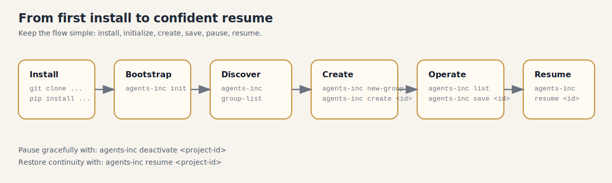

# agents-**inc.**

```text
    _    ____ _____ _   _ _____ ____      ___ _   _  ____
   / \  / ___| ____| \ | |_   _/ ___|    |_ _| \ | |/ ___|
  / _ \| |  _|  _| |  \| | | | \___ \     | ||  \| | |
 / ___ \ |_| | |___| |\  | | |  ___) |    | || |\  | |___
/_/   \_\____|_____|_| \_| |_| |____/    |___|_| \_|\____|
```

`agents-inc` turns your Codex workspace into a restart-safe project workflow.
It feels simple at the surface: define intent, create a project, keep moving, come back later, resume exactly where you left off.



## Install (Ready To Paste)

### Source install (best for local development)

```bash
git clone git@github.com:sacRedeeRhoRn/agents-inc.git
cd agents-inc
python3 -m pip install --upgrade pip
python3 -m pip install -e .
```

## Bootstrap Your Workspace

```bash
agents-inc init
```

If you saw `entrace init` in older notes, use `agents-inc init`.

What happens when you run this:
- You get an intake flow: start new project or resume existing project.
- `agents-inc` prepares/updates your local control state under `~/.agents-inc/`.
- Project artifacts are generated in a project root.
- Checkpoint + compact resume data are written for recovery.
- Managed chat can launch automatically (or stay terminal-only depending on your flow).

## First Practical Workflow (Minimal Commands)

1. See available groups:

```bash
agents-inc group-list
```

2. Create your first group (interactive):

```bash
agents-inc new-group
```

3. Create your first project:

```bash
agents-inc create <project-id>
```

4. List projects:

```bash
agents-inc list
```

Default listing includes `active` + `inactive`. Use `--include-stale` only when needed.

5. Deactivate a project you want to pause:

```bash
agents-inc deactivate <project-id>
```

6. Make a checkpoint snapshot before a risky change:

```bash
agents-inc save <project-id>
```

7. Resume later:

```bash
agents-inc resume <project-id>
```

## Need Full Flags and Features?

Use the full operator manual:
- [OVERVIEW.md](./OVERVIEW.md)

Quick references:
- Bootstrap prompt contract: [docs/bootstrap/START_IN_CODEX.md](./docs/bootstrap/START_IN_CODEX.md)
- Internal session intake details: [src/agents_inc/docs/internal/session-intake.md](./src/agents_inc/docs/internal/session-intake.md)
- Internal resume details: [src/agents_inc/docs/internal/session-resume.md](./src/agents_inc/docs/internal/session-resume.md)
- GitHub repository: [sacRedeeRhoRn/agents-inc](https://github.com/sacRedeeRhoRn/agents-inc)
