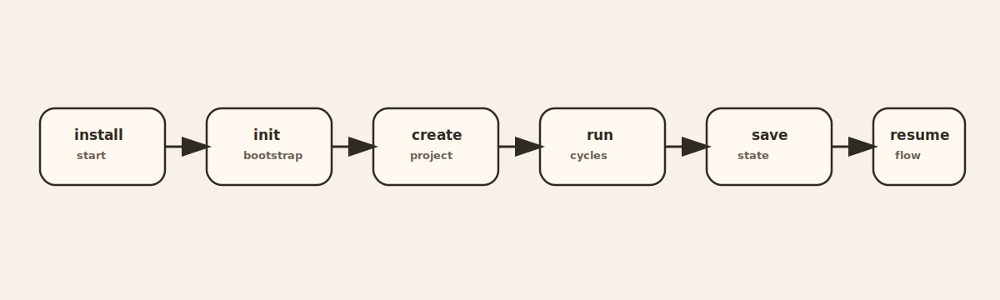
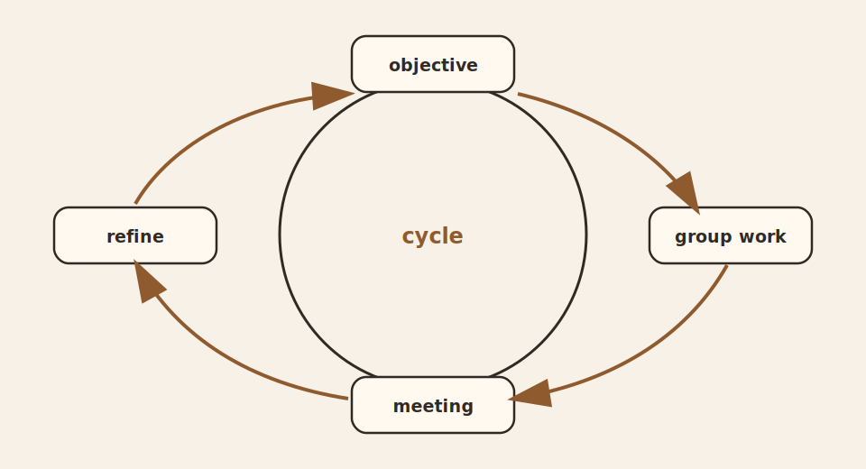
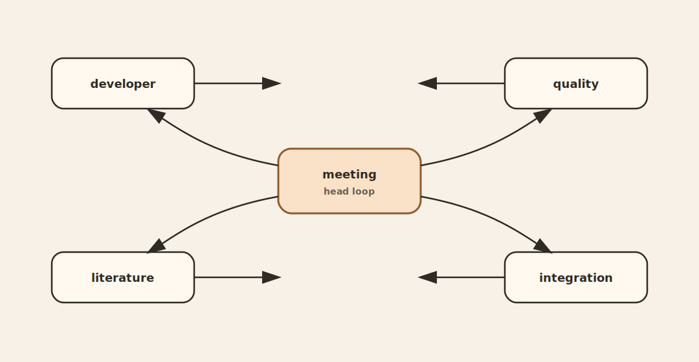
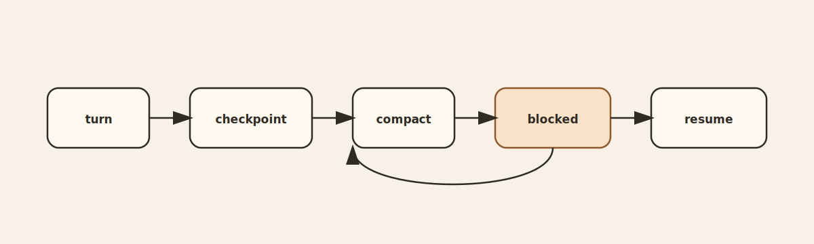

<div align="center">

# agents-inc

```text
   __ _  __ _  ___ _ __  | |___      ___
  / _` |/ _` |/ _ \ '_ \ | __\ \ /\ / (_)
 | (_| | (_| |  __/ | | || |_ \ V  V / _
  \__,_|\__, |\___|_| |_| \__| \_/\_/ (_)
        |___/
```

**A live multi-agent workshop for Codex.**

*Split the work. Let the groups challenge each other. Keep the state alive. Do not call it answered until the basis is explicit.*

</div>

`agents-inc` is built for sessions that should feel alive instead of linear.
You give it an objective.
It forms a working fabric around that objective, routes the pressure across groups, forces negotiation, records the state, and returns a consensus that is supposed to mean something.



## Character

- proud headers, not passive wrappers
- argument before shallow harmony
- evidence before comfort
- checkpoints before loss
- explicit basis before `ANSWERED`
- live recovery instead of disposable runs

What that means in practice:
- each project is a managed session, not a loose prompt log
- each active group defends its own field and pushes against weak conclusions
- the orchestrator should report one integrated conclusion for the user, not a pile of disconnected fragments
- when a turn blocks, the state is preserved so work can resume from a stable boundary



## How It Moves

1. You create a project and choose the groups that should matter.
2. `agents-inc` generates the project bundle, installs the managed skills, and opens the orchestrator chat.
3. Each turn is dispatched through the active groups.
4. Groups work, challenge, negotiate, and feed a head meeting.
5. The orchestrator returns a consensus conclusion with explicit basis, decision gates, and next actions.
6. The full turn state stays on disk so the session can be saved, resumed, inspected, or re-run.

## Modes

- `light`:
  default for new projects. Group headers run directly, absorb specialist contracts, and move faster.
- `full`:
  specialists run as separate sessions, then the headers merge, challenge, and publish exposed handoffs.

Use `light` when you want a smaller live surface with strong headers.
Use `full` when you want the full layered runtime.

## Install

```bash
git clone git@github.com:sacRedeeRhoRn/agents-inc.git
cd agents-inc
python3 -m pip install --upgrade pip
python3 -m pip install -e .
```

## Bootstrap

```bash
agents-inc init
```

If you saw `entrace init`, use `agents-inc init` instead.

What `init` does:
- prepares the project-scoped registry and working state
- installs managed skills needed by the generated project flow
- enables checkpoint, save, and resume behavior
- prepares the managed path used by orchestration sessions

## Group Creation

`agents-inc` ships with employable groups, but you can also author your own.
That matters when the default fabric is close, but not exact.

```bash
agents-inc group-list
agents-inc new-group
```

What `new-group` does:
- opens the guided group-creation flow
- captures the group identity, success criteria, and operating doctrine
- generates the group assets used by project creation
- makes the new group available in later project selection

Use `group-list` anytime to see what can currently be employed.

## First Project

```bash
agents-inc create <project-id>
```

What happens on `create`:
- you choose the groups that will work the objective
- `agents-inc` generates the project bundle and manifest
- managed skills are installed for that project
- the orchestrator chat starts immediately

During a live session:
- type `/agents-inc ...` to send the objective into orchestration
- type `/quit` or `/exit` to leave the session after a reply
- double-tap `Esc` to interrupt an active direct turn or orchestration turn

## Core Commands

```bash
agents-inc list
agents-inc save <project-id>
agents-inc resume <project-id>
agents-inc deactivate <project-id>
agents-inc delete <project-id>
```

Use them like this:
- `list`: show known projects, including inactive ones
- `save`: write a checkpointed project snapshot
- `resume`: reopen the orchestrator chat from the latest saved state
- `deactivate`: mark the project inactive without destroying its artifacts
- `delete`: remove project data after confirmation

## What Persists

On disk, the session keeps more than a chat trace.

- `.agents-inc/state`:
  registry links, activation state, session metadata
- `.agents-inc/turns`:
  turn directories, checkpoints, reports, consensus output, negotiation traces
- `agent-groups/<group>/exposed`:
  user-facing group artifacts and handoffs
- `agent-groups/<group>/internal`:
  specialist or internal working artifacts



## When It Blocks

A blocked turn is not a dead turn.
The important point is continuity.

- the run should preserve enough state to inspect what happened
- the session can be resumed instead of reconstructed from memory
- you restart from the last stable boundary, not from zero unless you choose to



## What The User Should Feel

`agents-inc` is not meant to feel like one assistant pretending to be many.
It is meant to feel like a small, opinionated working room:
- specialists or headers take positions
- weak claims get challenged
- satisfaction is earned, not declared instantly
- the answer comes back as a conclusion with basis, not a decorative transcript

## Read Next

- [OVERVIEW.md](./OVERVIEW.md)
- [docs/bootstrap/START_IN_CODEX.md](./docs/bootstrap/START_IN_CODEX.md)
- [src/agents_inc/docs/internal/session-intake.md](./src/agents_inc/docs/internal/session-intake.md)
- [src/agents_inc/docs/internal/session-resume.md](./src/agents_inc/docs/internal/session-resume.md)
- [sacRedeeRhoRn/agents-inc](https://github.com/sacRedeeRhoRn/agents-inc)
